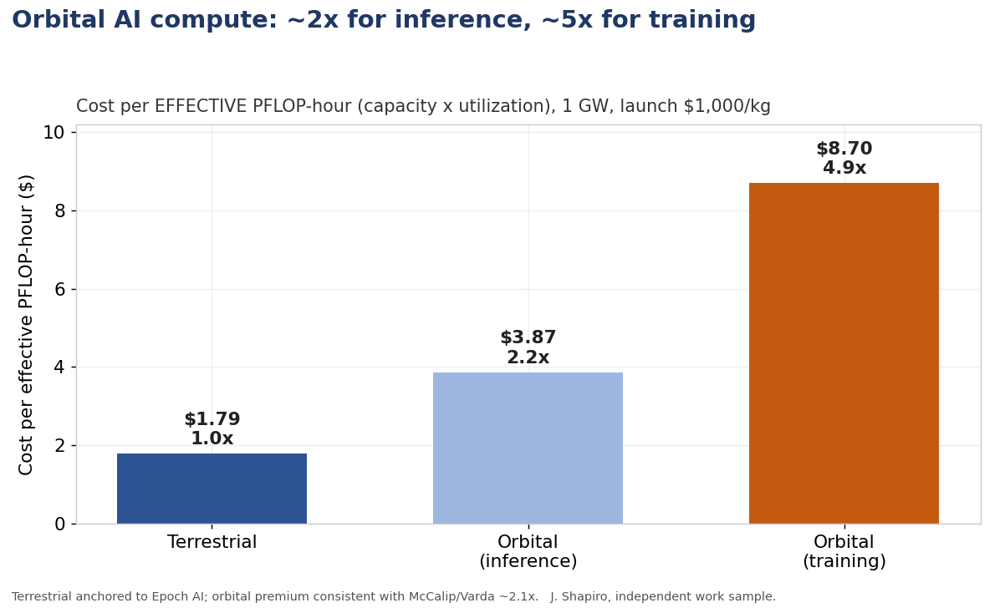
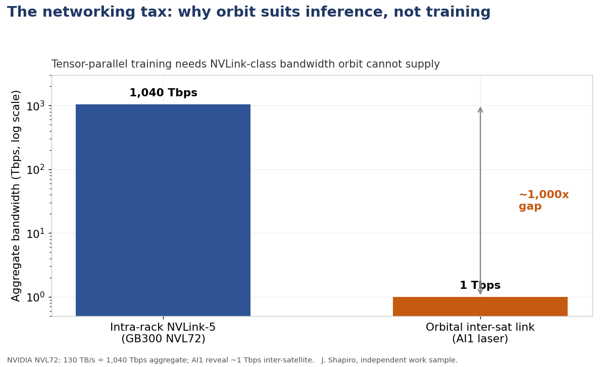
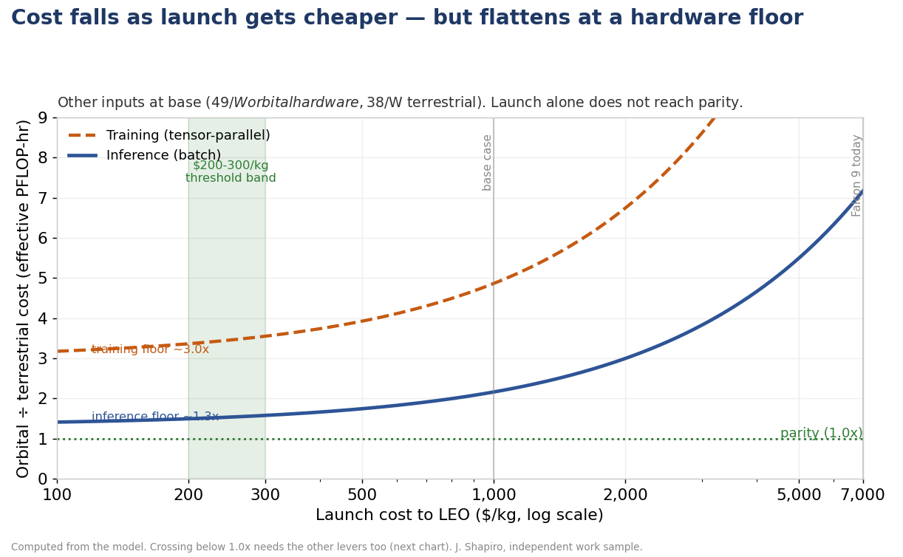
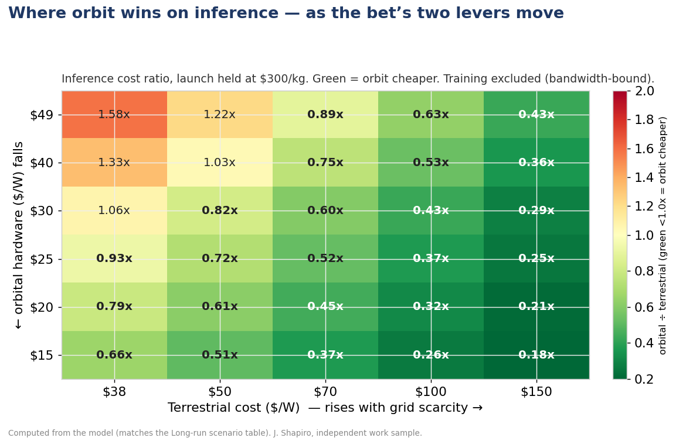
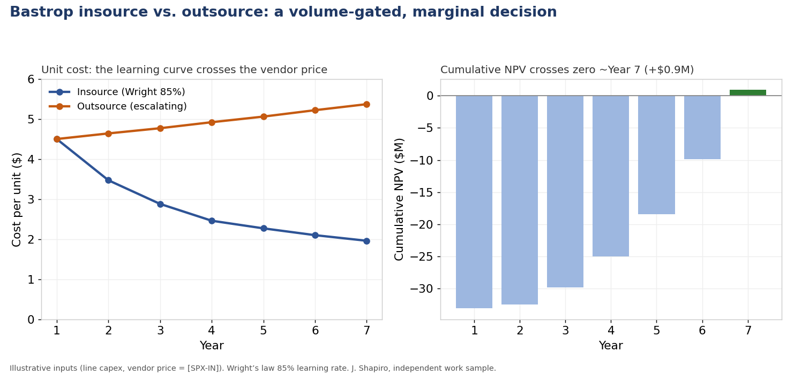
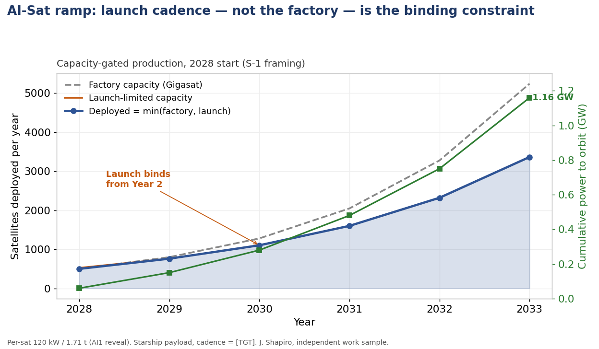
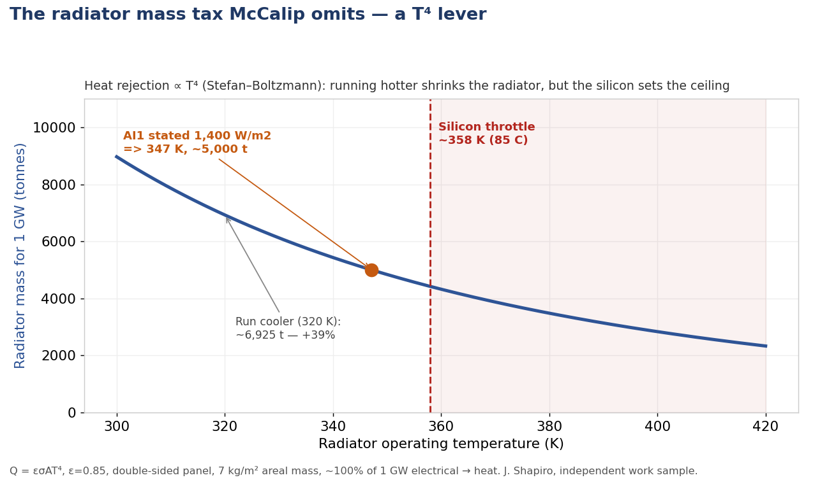

# Orbital Data Compute — Unit Economics

**A self-initiated unit-economics model of orbital AI data centers, built from public data.**

When does it make sense to put AI compute in orbit instead of on the ground — and what actually gates the build? This works that question from first principles in a single workbook: a core orbital-vs-terrestrial unit-economics model, a manufacturing build-vs-buy case, a production-ramp/constraint model, and a thermal-physics deep-dive. Every input is tagged for what it is.

I built it independently to pressure-test the economics in SpaceX's 2026 S-1 and the AI1 satellite reveal. It is **outside-in by design**: where a number can only come from inside SpaceX, the model says so and leaves the cell flagged rather than guessing.

> I am the inventor of US patents 9,264,662 and 9,270,937 (real-time UDP transport / forward error correction). The interconnect-bandwidth reasoning draws on that background; the rest is standard capital-cost modeling.

## The headline

At a not-yet-demonstrated $1,000/kg launch cost, orbital AI compute runs **~2.1× terrestrial cost per usable watt** and **~2.2× per effective inference PFLOP-hour — but ~4.9× for training.** The gap between those last two is the whole story: it's set by **interconnect bandwidth**, not dollars. So orbit is a **launch-cost option and an inference play, not a general-compute play** — exactly the workload the S-1 names.

| Workload | Cost per effective PFLOP-hour | vs. terrestrial |
|---|---|---|
| Terrestrial (1 GW) | $1.79 | 1.0× |
| Orbital — inference | $3.87 | 2.2× |
| Orbital — training | $8.70 | 4.9× |

## The model — `Orbital_Compute_Model.xlsx`

One integrated workbook. `Summary` dashboard → `Global Assumptions` (single source of truth for shared inputs — WACC, launch $/kg, target power, AI1 specs) → the four analyses → `Sources`. Change a value on Global Assumptions and every analysis (and its sensitivity tables) recomputes.

- **A1 — Orbital vs. Terrestrial** — cost per effective PFLOP-hour, plus the networking tax. The `A1 Sensitivity` tab carries the launch × specific-power and launch × asset-life crossover grids, a long-run scenario showing where inference crosses below 1.0×, and a launch-cost reference table.
- **A2 — Bastrop insource vs. outsource** — a build-vs-buy NPV / learning-curve case; volume-gated, and the value is the breakeven frontier, not a point estimate.
- **A3 — AI-Sat production ramp** — a capacity-gated ramp; the finding is that **launch cadence, not the factory, is the binding constraint.**
- **RAD Model — the radiator mass tax** — radiative cooling as a launch-cost-bearing mass tax floored by the silicon temperature limit.

## The networking tax (the differentiator)

Tensor-parallel, frontier-scale training needs NVLink-class bandwidth (~1,040 Tbps aggregate intra-rack) that orbit's ~1 Tbps inter-satellite laser links can't supply, so training utilization collapses in orbit; batch inference with preloaded weights tolerates the thin link. That's why the per-effective-FLOP gap differs ~2× (inference) vs. ~5× (training). It's not that training can *never* run in orbit — it's that synchronous, frontier-scale training is exactly what orbit is worst at, on both bandwidth and cost.

## Where the crossover sits

Launch is the master variable but not the only one. As launch falls below $1,000/kg toward the **$200–300/kg** band, the cost ratio drops steeply — but **flattens at a ~1.3× hardware floor** ($49/W orbital vs. $38/W terrestrial); launch alone doesn't reach parity. The ratio crosses **below 1.0× — orbit cheaper, for inference** — only when orbital hardware *also* falls and terrestrial *rises* (the long-run scenario on the `A1 Sensitivity` tab). This prices *where* the crossover sits, not *when* it arrives.

## The other analyses, at a glance

*A2 — the in-house learning curve crosses the vendor price; cumulative NPV is volume-gated.*

*A3 — deployment is capped by min(factory, launch); launch cadence binds from Year 2.*

*Radiator mass vs. operating temperature (T⁴) — floored by the silicon junction limit.*

## Sourcing discipline

Every input is tagged: **[FACT]** (published spec / SEC / paper), **[EST]** (third-party estimate), **[REVEAL]** (June 2026 AI1 reveal / trade-press — *not* a primary source), **[TGT]** (stated company/Musk target, not demonstrated), **[SPX-IN]** (illustrative placeholder needing an internal SpaceX number). Load-bearing anchors independently verified — McCalip/Varda (~3.2× on a terrestrial infra-only basis; this model's ~2.1× uses Epoch's fuller all-in $38/W), Epoch AI ($38/W, $8.5B/yr TCO), NVIDIA NVL72 (130 TB/s), MFU (PaLM 46.2% / Llama 3 38–43%), the Starlink dish cost-down, and Quilty per-satellite costs. Full citations are on the `Sources` tab; the June-2026 AI1 specs are tagged `[REVEAL]`.

## How to read it

Open the workbook; **`Global Assumptions`** is the single source of truth (blue = lever you can change, yellow = needs a real SpaceX number). Each analysis tab shows the build; each sensitivity tab shows what would change the conclusion.

---

*Built as a work sample. The point isn't a precise answer — no one outside SpaceX has the real cost stack — but a defensible framework: clean assumptions, sourced inputs, sensitivities, and an explicit statement of what would change the conclusion.*
